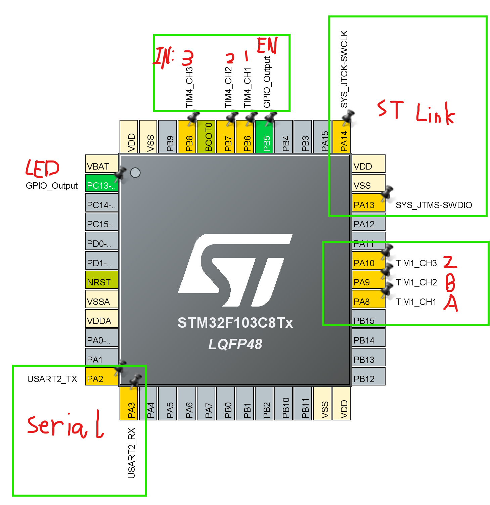
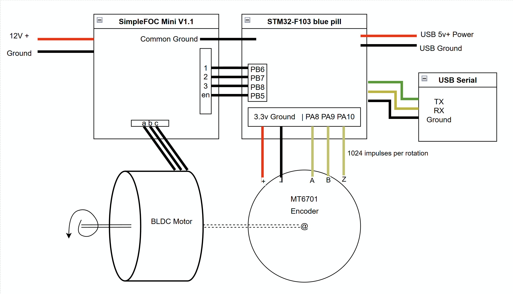
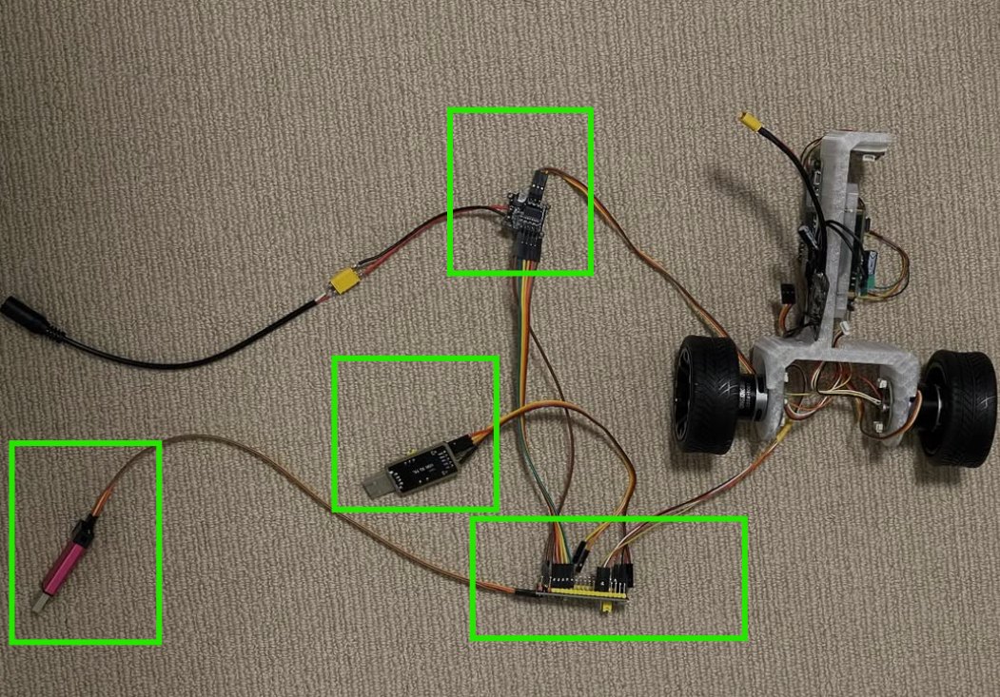

# STM32-F103 (Blue pill) with simple FOC

## Introduction
This is working demo with Simple FOC Aruino library with Blue pill.

## Hardware
- Blue pill STM32F103 (128kb needed for FOC lib size over 60kb)
- MT6701 Encoder
- BLDC motor
- USB external serial port
- STlink v2 or v3 for code upload

## Wire Tips
- 3 BLDC wire should be PWM enable and also in same time group.
- Encoder ABZ wire should also in a single group.
- STlink and serial is optional but is helpful in dev process.

**Blue pill pin out:**

**Wire Diagram:**

**Demo:**

