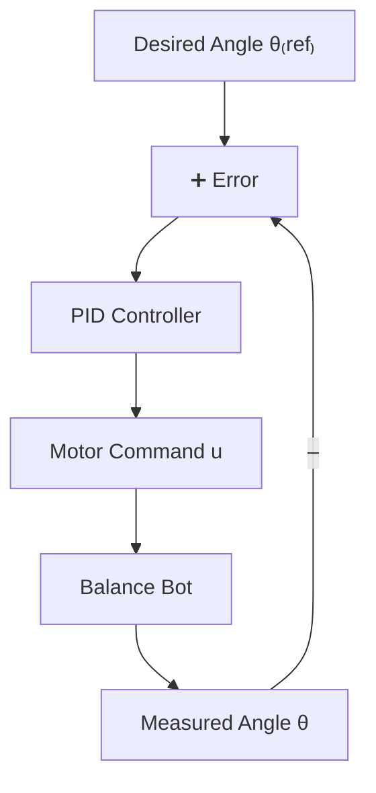

# 2D pid algorithm

## Introduction
2D PID algorithm  is commenly used to add lean angle to triditional PID control to build balance bot.
## Prerequirement

**Diagram:**


**Math:** 


$$
u(t) = K_p \cdot e(t) + K_i \int e(t)\, dt + K_d \frac{d e(t)}{dt}
$$

Where:

- Error term:

  $$
  e(t) = \theta_{\text{ref}} - \theta(t)
  $$

- \( K_p, K_i, K_d \) are the proportional, integral, and derivative gains
- \( u(t) \) is the motor control signal
## Code

```cpp
float Kp = 20.0;
float Ki = 0.5;
float Kd = 1.0;

float setpoint = 0.0;
float previousError = 0.0;
float integral = 0.0;

void loop() {
  float theta = readIMUAngle(); // your IMU function
  float error = setpoint - theta;

  integral += error;
  float derivative = error - previousError;

  float output = Kp * error + Ki * integral + Kd * derivative;

  setMotorPWM(output); // convert to PWM or direction

  previousError = error;
}
```
