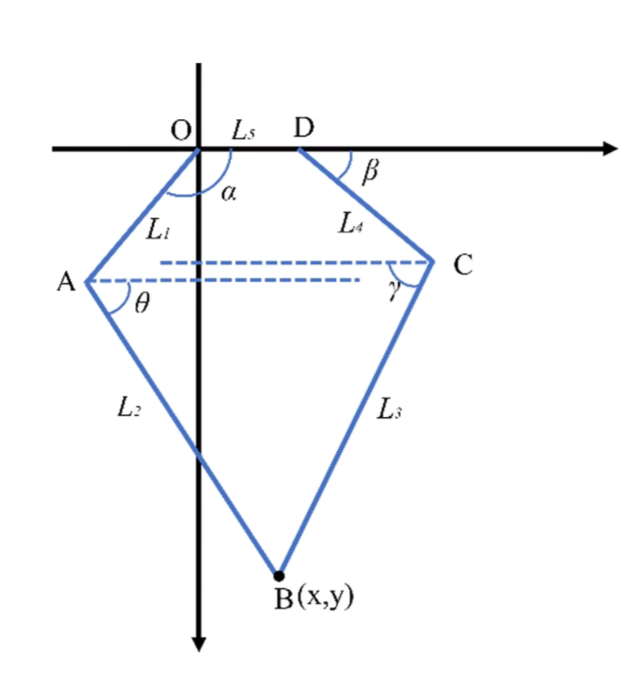

# 5R parallel leg math model

## Introduction
This is basic 5 link log math model needed to calculate position based on input angle.
## Prerequirement

**Diagram:**

## Mathematical Formulation:

**Inverse Kinematics Equations** 

Given:

- Desired position: \( (X, Y) \)
- Link lengths: \( L_1, L_2, L_3, L_4, L_5 \)

**Intermediate variables:**

$$
a = 2 L_1 X
$$

$$
b = 2 L_1 Y
$$

$$
c = X^2 + Y^2 + L_1^2 - L_2^2
$$

$$
d = 2 L_4 (X - L_5)
$$

$$
e = 2 L_4 Y
$$

$$
f = (X - L_5)^2 + L_4^2 + Y^2 - L_3^2
$$

**Inverse kinematics solution:**

$$
\alpha_{1,2} = 2 \arctan\left(\frac{b \pm \sqrt{a^2 + b^2 - c^2}}{a + c}\right)
$$

$$
\beta_{1,2} = 2 \arctan\left(\frac{e \pm \sqrt{d^2 + e^2 - f^2}}{d + f}\right)
$$

**Angle to degrees conversion:**

$$
\text{angle}_\alpha = \frac{\alpha}{2\pi} \cdot 360 \quad\quad \text{angle}_\beta = \frac{\beta}{2\pi} \cdot 360
$$

## Code


```jsx title="5r-left.cpp"
void inverseKinematics(){
// Main inverse kinematics function
void inverseKinematics() {
  float alpha1, alpha2, beta1, beta2;
  uint16_t servoLeftFront, servoLeftRear;

  // Calculate intermediate variables based on geometry and desired position
  float aLeft = 2 * IKParam.XLeft * L1;
  float bLeft = 2 * IKParam.YLeft * L1;
  float cLeft = IKParam.XLeft * IKParam.XLeft + IKParam.YLeft * IKParam.YLeft + L1 * L1 - L2 * L2;

  float dLeft = 2 * L4 * (IKParam.XLeft - L5);
  float eLeft = 2 * L4 * IKParam.YLeft;
  float fLeft = ((IKParam.XLeft - L5) * (IKParam.XLeft - L5) + L4 * L4 + IKParam.YLeft * IKParam.YLeft - L3 * L3);

  // Compute possible angles using the inverse kinematics equations
  alpha1 = 2 * atan((bLeft + sqrt((aLeft * aLeft) + (bLeft * bLeft) - (cLeft * cLeft))) / (aLeft + cLeft));
  alpha2 = 2 * atan((bLeft - sqrt((aLeft * aLeft) + (bLeft * bLeft) - (cLeft * cLeft))) / (aLeft + cLeft));
  beta1 = 2 * atan((eLeft + sqrt((dLeft * dLeft) + eLeft * eLeft - (fLeft * fLeft))) / (dLeft + fLeft));
  beta2 = 2 * atan((eLeft - sqrt((dLeft * dLeft) + eLeft * eLeft - (fLeft * fLeft))) / (dLeft + fLeft));

  // Ensure angles are within 0 to 2π range
  alpha1 = (alpha1 >= 0) ? alpha1 : (alpha1 + 2 * PI);
  alpha2 = (alpha2 >= 0) ? alpha2 : (alpha2 + 2 * PI);

  // Select feasible solution based on expected joint limits
  IKParam.alphaLeft = (alpha1 >= PI / 4) ? alpha1 : alpha2;
  IKParam.betaLeft = (beta1 >= 0 && beta1 <= PI / 4) ? beta1 : beta2;

  // Convert radians to degrees
  int alphaLeftToAngle = (int)((IKParam.alphaLeft / (2 * PI)) * 360);
  int betaLeftToAngle = (int)((IKParam.betaLeft / (2 * PI)) * 360);

  // Adjust angle to match servo neutral at 90 degrees
  servoLeftFront = 90 + betaLeftToAngle;
  servoLeftRear = 90 + alphaLeftToAngle;
}
```

## Result output

