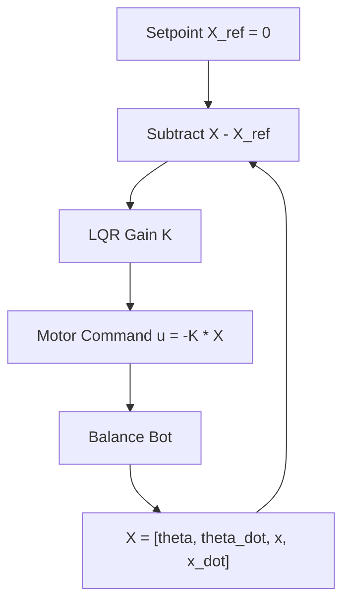

# LQR algorithm

## Introduction
The LQR algorithm is essentially an automated way of finding an appropriate state-feedback controller.
## Prerequirement

**Diagram:**


**Control Equation (Math)** 

$$
u = -K \cdot X
$$

Where:

- \( u \): control input (motor signal)
- \( K \): gain matrix
- \( X \): state vector

The state vector is:

$$
X = \begin{bmatrix} \theta \\ \dot{\theta} \\ x \\ \dot{x} \end{bmatrix}
$$

And the gain matrix is:

$$
K = \begin{bmatrix} k_1 & k_2 & k_3 & k_4 \end{bmatrix}
$$
**Cost Function:**

The LQR controller minimizes the cost function:

$$
J = \int_0^\infty \left( X^\top Q X + u^\top R u \right) dt
$$

Where:

- \( Q \): state weighting matrix
- \( R \): control effort weighting (scalar or matrix)

**Notes:**

- Gains \( K \) are computed offline using tools like MATLAB or Python (`scipy`, `control`).
- The matrices \( Q \) and \( R \) define the trade-off between performance and effort.
## Code

```cpp
// LQR gains (precomputed offline using MATLAB or Python)
float k1 = 12.5;
float k2 = 1.8;
float k3 = 0.8;
float k4 = 0.3;

void loop() {
  float theta = readIMUAngle();           // θ
  float theta_dot = readGyro();           // θ̇
  float x = readEncoderPosition();        // x
  float x_dot = readEncoderVelocity();    // ẋ

  float u = - (k1 * theta + k2 * theta_dot + k3 * x + k4 * x_dot);

  setMotorPWM(u);
}
```
